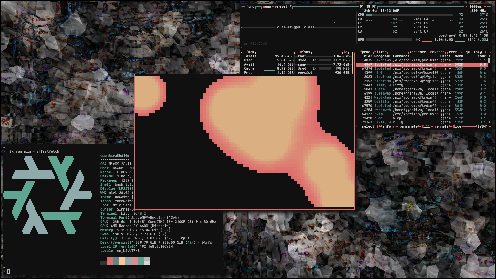

# NixOS Configuration



A declarative system configuration using NixOS along with Nix flakes, following
the dendritic pattern to manage many systems with reusable modules.

## Hosts

| Name  | Description                                                  | Type    |
| ----- | ------------------------------------------------------------ | ------- |
| h610m | Desktop using Niri with full-disk LUKS encryption            | Desktop |
| hp705 | Headless system running a collection of self-hosted services | Server  |
| iso   | Custom live media used as an installer                       | ISO     |

All systems share common modules while implementing different functionality
depending on their role.

## Repository Structure

```text
.
├── flake.nix
├── modules
│   ├── cli/ # Command-line applications and terminal-oriented configuration.
│   ├── gui/ # Graphical applications and desktop-environment configuration.
│   ├── hosts/  # Per-host configurations
│   ├── nix/ # Nix configuration, including Home Manager, SOPS, impermanence, flake parts, and shared constants.
│   ├── services/ # self-hosted services, including vaultwarden, jellyfin and more.
│   ├── system/ # Core settings of the operating system, as well as system types that group modules together.
│   └── users/ # User accounts,settings and SSH keys
└── secrets.yaml Sops secrets
```

## Features

- Impermanence with btrfs and tmpfs on /. The root filesystem is ephemeral.
  State that needs to survive reboots is explicitly persisted using
  impermanence. and restores the system to a clean state.
- Disko for partitioning and formatting declaratively.
- Sops-nix for managing secrets.
- Home Manager as a NixOS module for handling user environments.

## Installation

1. Clone the repository.

```bash
git clone https://codeberg.org/ggantiva/nixos
```

2. Change directory.

```bash
cd nixos
```

3. Run disko with the defined system flake. Keep in mind that the following
   command destroys and reformats the disks defined by the selected Disko
   configuration. Verify the target configuration before running it and make
   backups as needed.

```bash
nix --experimental-features "nix-command flakes" run github:nix-community/disko/latest -- --mode destroy,format,mount --flake .#<System>
```

4. Install NixOS

```bash
nixos-install --flake .#<hostname> --no-root-passwd
```

## Adding new systems

1. Add a file in the hosts directory, following the structure of the other
   system configurations. It must contain the following:

```nix
flake.nixosConfigurations.<hostname> = inputs.nixpkgs.lib.nixosSystem {
    modules = with self.modules.nixos; [
        <nixos-modules>
    ];
};
```

And it also needs to have the hardware configuration which can be generated on
the target system using:

```bash
nixos-generate-config
```

The output file can be imported as a module.

## License

All files in this repository are licensed under the GNU General Public License
v3.0 or later, unless otherwise stated.

See LICENSE for the full license text.
